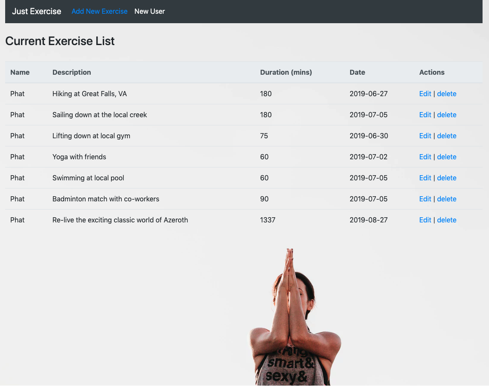

# Just Exercise

Just Exercise is a simple and single page web application that enables the User to organize activities with the power to add, update, and delete a list of planned activities.

This full stack application enabled me to gain more practice and better familiarity building an application from the ground up. Building and setting up the back end with proper/restful routes, then deploying the API. For the front end, more practices with JavaScript ES6 functions, React ecosystem, but overall insights into the process.

 Something new and interesting was utilizing React component called Date Picker. It enabled a User to choose a date from a popped-up calendar.

## Deployed

http://just-exercise.surge.sh



## Getting Started

For testing purpose, clone this repository from Github.

After cloning down the repository, change into the directory.
```
cd mern-excercise-tracker
``` 


Install all dependecies with the command: 
```
npm install
```

To launch the application on your computer: 
```
npm start
```

## Technology Used

Front End :
- React
- HTML5
- CSS3 via Bootstrap
- Surge deployment

Back End:
- Node.js
- Express
- MongoDB
- Mongoose
- Heroku (API Deployment)
- MLABS & AWS 
